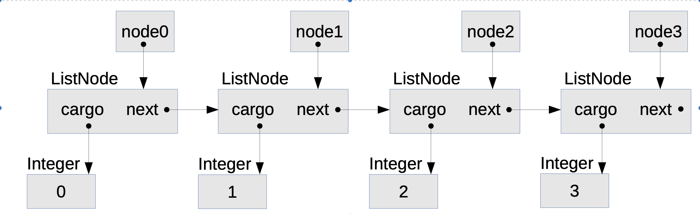

# 03. ArrayList

일전에 구현한 MyArrayList를 분류해보자
```java
@Override
public T set(int index, T element) {
//	Replaces the element at the specified position in this list with the specified element (optional operation).
    T old = get(index);
    array[index] = element;
    return old;
}
```
모든 것이 상수 시간이다.

```java
@Override
public T set(int index, T element) {
//	Replaces the element at the specified position in this list with the specified element (optional operation).
    T old = get(index);
    array[index] = element;
    return old;
}
```
get을 통해서 간접적으로 배열 범위를 탐색하며, get을 포함한 set 역시 모두 상수 시간 이다.

```java
@Override
public int indexOf( Object target ) {
    // Returns the index of the first occurrence of the specified element in this list, or -1 if this list does not contain the element.
    for ( int i = 0; i < size; i++ ) {
        if ( equals(target, array[i]) ) {
            return i;
        }
    }
    return -1;
}

private boolean equals(Object target, Object element) {
    if (target == null) {
        return element == null;
    } else {
        return target.equals(element);
    }
}
```
반복할 때마다 indexOf는 equals를 호출한다. 이는 간소하게, 배열의 각 요소를 비교하므로 상수 시간으로 전제하고 넘어가자 다시
indexOf안의 반복문으로 가면 상수 시간 메소드가 운이 좋다면 한 번, 많으면 배열의 요소 만큼 탐색한다. 평균적으로 중간 정도로 보고 
선형이라고 생각할 수 있다.

```java
@Override
public T remove(int index) {
    // Removes the element at the specified position in this list (optional operation).
    T result = get(index);
    for ( int i = index; i < size - 1; i ++ ){
        array[i] = array[i+1];
    }
    size --;
    return result;
}
```
`remove`는 맨 뒤 요소를 삭제하면 상수이지만 맨 앞이라면 선형이 된다. 따라서 `remove`는 선형이 된다.

```java
@Override
public boolean add(T element) {
    //Appends the specified element to the end of this list (optional operation).
    if (size >= array.length) { 
        T[] bigger = (T[]) new Object[array.length * 2];
        System.arraycopy(array, 0, bigger, 0, array.length);
        array = bigger;
    }
    array[size] = element;
    size++; 
    return true;
}

@Override
public void add(int index, T element) {
    if (index < 0 || index > size) throw new IndexOutOfBoundsException();
    
    // add the element to get the resizing
    add(element);
    
    for (int i=size-1; i>index; i--){ 
        array[i]=array[i-1]; 
    }
    
    // put the new one in the right place
    array[index] = element;
    }
```
위의 add는 미사용 공간이 있으면 상수다. 하지만 `System.arraycopy`를 사용하면 배열의 크기에 비례하기 때문에 선형이 된다.
이 경우 add는 상수일까? 선형일까?


2로 요소의 크기를 초기화한 배열로 생각해보자. 
1. 처음 add하면 미사용 공간을 찾아 요소를 저장한다.
2. 두 번째도 공간이 있다면 요소를 저장한다.
3. 세 번째에 배열의 크기를 변경하고 요소를 2개 복사하고 요소 1개를 저장한다. 배열의 크기는 4이다.
4. 네 번째에 요소를 저장한다.
5. 다섯 번째 크기를 재조정하고 요소를 이관한다. 추가로 요소 1개를 저장한다. 배열의 크기는 8이다.
6. 여섯 ~ 여덟번째로 요소를 저장한다.
7. 아홉 번째에 요소 8개를 복사하고 요소 1개를 저장한다. 배열 크기는 16이다. 
8. n 번의 add 호출 후에는 n 개를 저장하고 

```
(개수) 요소...
(2) 1
(2) 1, 2

(4) 1, 2, 3  
(4) 1, 2, 3, 4

(8) 1, 2, 3, 4, 5
(8) 1, 2, 3, 4, 5, 6
(8) 1, 2, 3, 4, 5, 6, 7
(8) 1, 2, 3, 4, 5, 6, 7, 8

(16) 1, 2, 3, 4, 5, 6, 7, 8, 9
(16) 1, 2, 3, 4, 5, 6, 7, 8, 9, 10
(16) 1, 2, 3, 4, 5, 6, 7, 8, 9, 10, 11
(16) 1, 2, 3, 4, 5, 6, 7, 8, 9, 10, 11, 12
(16) 1, 2, 3, 4, 5, 6, 7, 8, 9, 10, 11, 12, 13
(16) 1, 2, 3, 4, 5, 6, 7, 8, 9, 10, 11, 12, 13, 14
(16) 1, 2, 3, 4, 5, 6, 7, 8, 9, 10, 11, 12, 13, 14, 15
(16) 1, 2, 3, 4, 5, 6, 7, 8, 9, 10, 11, 12, 13, 14, 15, 16

(32) 1, 2, 3, 4, 5, 6, 7, 8, 9, 10, 11, 12, 13, 14, 15, 16, 17
```
<p style="color:#ce8989">* 패턴 확인 다시 할 필요가 있다.</p>

? 패턴을 보면 n번 추가하면 n개의 요소를 저장하고 n-2개를 복사해야한다. 총 연산 횟수는 2n - 2가 된다. 
평균 연산 횟수를 구하려면 합을 n으로 나눠야해서 결과는 2 - (2/n)가 된다. n의 가장 큰 지수에만 관심을 가진다는 원칙을 적용하면
add는 상수 시간으로 간주된다.

일련의 호출에서 평균 시간을 계산하는 알고리즘 분류 방법을 분할 상환 분석`amortized analysis`이다.

```java
@Override
public boolean removeAll(Collection<?> collection) {
    boolean flag = true;
    for (Object obj: collection) {
        flag &= remove(obj);
    }
    return flag;
}
```
위 메소드는 반복문 안에서 선형인 `remove`를 호출한다. 그래서 이차로 생각할 수 있다. 반드시 그런 것은 아니다. 

이 메소드에서 반복문은 collection 인자를 한 번씩 순회한다. collection의 요소가 m개고 제거할 리스트에 요소가 n개 있다면
이 메소드는 O(mn)이다. 만약 collection의 크기가 상수라면 removeAll은 n에 대해서 선형이다. 만약 collection이 n에 비례하면
removeAll은 `이차`이다.

이처럼 문제 크기에 관해 고려할 때 대상이 어떤 크기(들)인지 확인해야한다. 


# 3.4 연결 자료구


