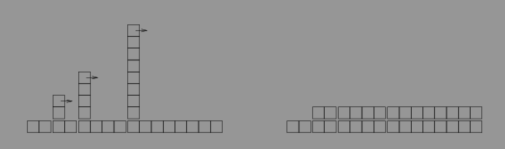

# 11. HashMap

n개의 엔트리와 k개의 하위 맵이 있다면 하위 맵의 크기 평균은 n/k가 되고 여전히 n에 비례하게 된다.
하지만 n과 함께 k를 늘려간다면 n/k의 크기를 제한할 수 있다. 

예를 들어, 매번 n이 k를 초과하면 k를 두 개 로 늘린다고 해보자. 그러면 Map당 엔트리의 개수가 평균적으로 1보다 작을 것이다. 
하위 Map당 엔트리의 개수가 일정하면 단일 하위 맵은 상수 시간으로 검색할 수 있다.
```java
public class MyHashMap<K, V> extends MyBetterMap<K, V> implements Map<K, V> {

    // average number of entries per map before we rehash
    protected static final double FACTOR = 1.0;

    @Override
    public V put(K key, V value) {
        V oldValue = super.put(key, value);
        //System.out.println("Put " + key + " in " + map + " size now " + map.size());
        // check if the number of elements per map exceeds the threshold
        if (size() > maps.size() * FACTOR) { //  == size() / maps.size() > FACTOR
            rehash();
        }
        return oldValue;
    }
}
```
put을 할 때 임계치를 넘지 않는지 확인하고 reHash한다. 상수 FACTOR는 로드 팩터(load factor)라고 하며 평균적으로
하위 Map당 최대 엔트리 개수를 결정한다. 

```java

@Override
public V put(K key, V value) {
    V oldValue = super.put(key, value);
    //System.out.println("Put " + key + " in " + map + " size now " + map.size());
    // check if the number of elements per map exceeds the threshold
    if (size() > maps.size() * FACTOR) {
    rehash();
    }
    return oldValue;
}
protected void rehash() {
    List<MyLinearMap<K, V>> oldMaps = maps;
    makeMaps(maps.size() * 2);

    for (MyLinearMap<K, V> map: oldMaps) {
        for (Map.Entry<K, V> entry: map.getEntries()) {
            this.put(entry.getKey(), entry.getValue());
        }
    }
}
```
이와 같이 임계치에 달했을 때 두 배씩 증가 시키면, k가 n에 비례헤서 늘어나면 핵심 메소드도 상수 시간이 된다. put이 살짝 문제가 되는데,
재해시를 할 필요가 없다면 상수 시간이지만, 재해시를 하면 선형이 된다. 이전에 분류해본 add와 유사하다. 
이와 같은 이유로 일련의 호출을 평균하면 위 put은 상수가 된다. (이전에 add가 일정 패턴이 생겼고 총 연산 횟수를 구해서 n이 큰 부분에 관심을 가져 상수로 간주한다는 결론을 지었다.)
<p style="color:#ce8989">* 패턴 확인 다시 할 필요가 있다. 3장 add와 비슷하다고 하는데...</p>


여기서 k가 너무 작으면 재해시가 너무 잦아지고 결과적으로 상수시간이 아니게 된다. 

## 11.3 트레이드오프
위에서 containsKey, get, remove이 상수 시간이고 put이 평균적으로 상수 시간임을 확인했다.(...)
일단 각 작업 단위가 같은 시간이 걸린다는 단순한 모델을 기반으로 하고 있다는 것을 상기하자. 실제로는 더 복잡하다. 특히나 캐시에 적합할
정도의 자료구조라면 빠르지만 메모리에 적재해야할 정도라면 조금 느려진다. 혹여나 메모리에도 적재할 수 없는 사이즈라면 더 느려진다.

추가적으로 위 구현은 키가 아니라 값이 주어지면 해싱에 도움이 되지 않는다는 것이다. `containsValue`는 모든 하위 맵을 탐색해야 하므로 선형이다.
또 한가지 한게는 이전의 MyLinearMap에서 상수 시간인 일부 메소드가 선형이 된다.

```java
@Override
public void clear() {
    for (int i=0; i<maps.size(); i++) {
        maps.get(i).clear();
    }
}
```
clear는 모든 하위 맵을 비워야 하고, 하위 맵의 개수는 n에 비례한다. 