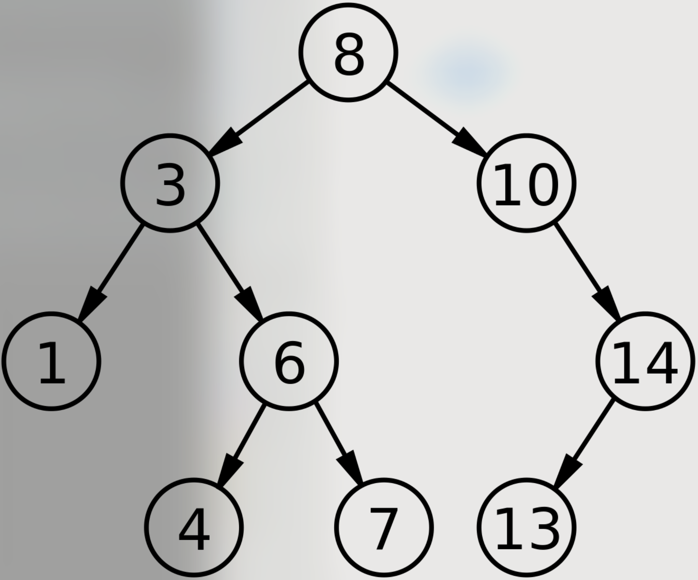
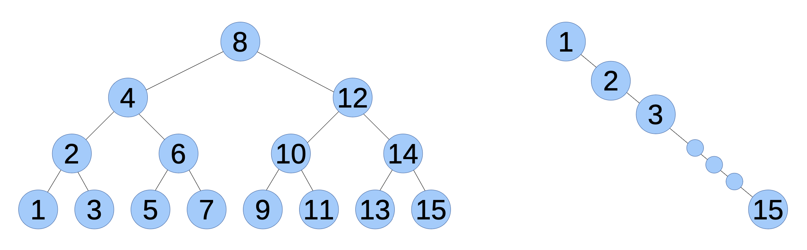

# 12. TreeMap

## 12.1 해싱의 문제점
Map 구현체가 HashMap만 있는 것은 아니다. 이유는 아래와 같다.
1. HashMap 클래스의 연산이 상수 시간이라고 해도 해싱이 느릴 수 있다. 즉, 상수가 꽤 커질 수 있다.
2. 해시 함수가 하위 맵에 키를 고루 분배하면 해싱은 잘 동작할 것이다. 그러나 좋은 해시 함수를 설계하는 것은 어렵다. 그리고 너무 많은 키가 특정 하위 맵에 집중되면 성능이 나빠질 수 있다.
3. 해시 테이블에 있는 키는 순서대로 저장되지 않는다. 그리고 키가 재해시될 때 순서가 변하기도 한다. 

이러한 문제를 어느 정도 해결할 수 있는 TreeMap을 자바는 제공한다. 

1. TreeMap 클래스는 해시 함수를 사용하지 않는다. 따라서 해싱 비용과 해시 함수를 고르는 어려움을 피할 수 있다. 
2. TreeMap 클래스의 내부에서 키는 이진트리에 저장되는데, 선형 시간으로 키를 순서대로 순회할 수 있다. 
3. 핵심 메소드의 실행시간은 log n 에 비례해서 상수 시간만큼 우수하지는 않지만, 꽤 쓸 만하다. 

## 12.2 이진 탐색 트리


1. 노드 왼쪽에 자식이 있다면 왼쪽 하위 트리의 모든 키는 노드에 있는 키보다 작다. 
2. 노드 오른쪽에 자식이 있다면 오른쪽 하위 트리의 모든 키는 노드에 있는 키보다 크다. 

이러한 이유로 트리 전체를 검색할 필요가 없어서 이진 탐색 트리에 있는 키의 검색 속도는 빠르다. 

1. 찾는 키인 target을 현재 노드와 비교, 같다면 검색이 끝
2. target이 현재 키보다 작다면 왼쪽 키를 검색, 왼쪽 트리에 없다면 target이 없음
3. target이 현재 키보다 크다면 오른쪽 키를 검색, 오른쪽 트리에 없다면 target이 없음
이렇게 찾는 과정은 트리에 있는 키의 개수가 아니라 트리의 높이에 비례한다. 
트리의 높이인 h와 노드의 개수인 n 사이의 관계는 어떻게 알 수 있을까?


1. h = 1이면 트리에는 1개 노드만 있으므로 n = 1
2. h = 2이면 2개의 노드를 추가할 수 있고 n = 3
3. h = 3이면 4개까지 더 추가할 수 있고 n = 7
4. 결론적으로 n = 2<sup>h</sup> - 1가 된다. 
5. 대략적으로 h = log<sub>2</sub>n 쯤 된다. 

이는 트리에 노드가 가득차면 트리 높이는 log n에 비례함을 의미한다. 따라서 이진 탐색 트리에서 log n에 비례하는 시간으로 키를 찾을 수 있다고 
생각할 수 있지만 늘 그렇지는 않다. 

log n에 비례하는 시간이 걸리는 알고리즘을 로그 시간이라고 한다. 증가 차수는 O(log n)이다.

## 12.3 이진 맵 실습
```java
public class MyTreeMap<K, V> implements Map<K, V> {

	private int size = 0;
	private Node root = null;

	/**
	 * Represents a node in the tree.
	 *
	 */
	protected class Node {
		public K key;
		public V value;
		public Node left = null;
		public Node right = null;
    }

    @Override
    public int size() {
        return size;
    }
    
    @Override
    public void clear() {
        size = 0;
        root = null;
    }

    private Node findNode(Object target) {
        // some implementations can handle null as a key, but not this one
        if (target == null) {
            throw new IllegalArgumentException();
        }

        // something to make the compiler happy
        @SuppressWarnings("unchecked")
        Comparable<? super K> k = (Comparable<? super K>) target;

        // the actual search
        Node node = root;
        while (node != null) {
            int cmp = k.compareTo(node.key);
            if (cmp < 0)
                node = node.left;
            else if (cmp > 0)
                node = node.right;
            else
                return node;
        }
        return null;
    }

    @Override
    public boolean containsValue(Object target) {
        return containsValueHelper(root, target);
    }

    private boolean containsValueHelper(Node node, Object target) {
        if (node == null) {
            return false;
        }
        if (equals(target, node.value)) {
            return true;
        }
        if (containsValueHelper(node.left, target)) {
            return true;
        }
        if (containsValueHelper(node.right, target)) {
            return true;
        }
        return false;
    }

    @Override
    public V put(K key, V value) {
        if (key == null) {
            throw new NullPointerException();
        }
        if (root == null) {
            root = new Node(key, value);
            size++;
            return null;
        }
        return putHelper(root, key, value);
    }

    private V putHelper(Node node, K key, V value) {
        @SuppressWarnings("unchecked")
        Comparable<? super K> k = (Comparable<? super K>) key;
        int cmp = k.compareTo(node.key);

        if (cmp < 0) {
            if (node.left == null) {
                node.left = new Node(key, value);
                size++;
                return null;
            } else {
                return putHelper(node.left, key, value);
            }
        }
        if (cmp > 0) {
            if (node.right == null) {
                node.right = new Node(key, value);
                size++;
                return null;
            } else {
                return putHelper(node.right, key, value);
            }
        }
        V oldValue = node.value;
        node.value = value;
        return oldValue;
    }

}
```

size는 상수 시간이다. clear도 그 자체로는 그렇다. null로 만들고 가비지 컬렉터가 수행하는 시간까지 생각하면 선형 시간이 걸린다.
findNode의 경우 한 가지 경로만 검색하므로 높이에 비례한 시간이 걸린다. containsValue의 경우 전체 탐색으로 높이 h가 아닌 키의 개수인 n에 비례한다. 
put의 경우 요소의 개수인 n이 아닌 높이인 h에 비례한 시간이 걸린다. 아래에서 조금 더 자세하게 보자.

## 13.3 put 메소드

1. 주어진 키가 이미 트리에 있으면 값을 대체하고 기존 값을 반환하는 작업
2. 주어진 키가 트리에 없으면 올바른 위치에 새로운 노드를 추가하는 작업

이 두 가지를 모두 처리해야한다. 간단하게 이 과정을 서술하면 일단 비교하고 없으면 추가하고 있으면 그 하위노드로 재귀호출을 보낸다.


## 13.4 중위 순회

```
* 순회
        ROOT     전위 순회: ROOT -> L -> R
       ╱    ╲    중위 순회: L -> ROOT -> R
      A      B   후위 순회: L -> R -> ROOT
```
```java
@Override
    public Set<K> keySet() {
        Set<K> set = new LinkedHashSet<K>();
        addInOrder(root, set);
        return set;
    }

    private void addInOrder(Node node, Set<K> set) {
        if (node == null) return;
        addInOrder(node.left, set);
        set.add(node.key);
        addInOrder(node.right, set);
    }
```

keySet 메소드는 트리에 있는 키를 오름차순으로 포함하는 Set을 반환한다. Map의 다른 구현은 keySet 반환에 순서가 없지만, 트리 구현의 장점 중 하나는
단순하고 효율적으로 키를 정렬할 수 있다는 것이다. 따라서 이러한 장점을 활용하여 반환한다.

이 구현 역시 재귀적으로 왼쪽 -> 하위 -> 하위 .... 하위의 오른쪽 ... -> 중간 -> 오른쪽 -> .. 순으로 순회한다.

## 13.5 로그 시간 메소드
구현해 본 TreeMap은 get, put의 실행 시간이 트리의 높이인 h에 비례한다. 일전에 트리의 모든 수준이 노드를 최대로 포함하면 트리의 높이는 log n에 비례한다고 했다.
문자열을 추가하는 트리와 timestamp를 추가하는 트리 두 가지 케이스로 실험을 진행했다.

```git

Testing MyTreeMap with random strings
    Time in milliseconds = 49
    Final size of MyTreeMap = 16384
    log base 2 of size of MyTreeMap = 14.0
    Final height of MyTreeMap = 35

Testing MyTreeMap with timestamps
    Time in milliseconds = 1016
    Final size of MyTreeMap = 16384
    log base 2 of size of MyTreeMap = 14.0
    Final height of MyTreeMap = 16384
```

결과적으로 randomString은 높이가 33으로 16384 중 하나를 찾으려면 33번만 비교하면 된다. 선형 검색과 비교하면 500배 정도 빠르다.
높이는 높지만 여전히 n 보다 log n에 비례한다.

timestamp를 보면 이진트리가 큰 의미가 없음을 알 수 있다. 불균형트리이기 때문이다. 균형 트리는 높이가 4라면 노드 개수가  2<sup>4</sup> - 1 = 15가 된다.
불균형 트리는 높이가 15가 된다.
 


## 13.6 자가 균형 트리<sup>[[1]](#selfbalancetree)</sup>


1. Map 객체에 키를 순서대로 넣지 않는다. 그러나 항상은 불가능하다. 
2. 키가 순서대로 오더라도 이를 대응하도록 트리를 만든다. 

두 번째 방법으로 해결해 볼 것이다. put을 고쳐서 트리가 불균형해지면 이를 탐지하고 노드를 재배열하면 된다. 이를 자가 균형이라고 한다.
일반적 자가 균형 트리는 AVL트리, 자바의 TreeMap이 사용하는 레드블랙 트리(red-black tree)가 있다.


```java
//일단 좋은 코드는 아닌 것 같지만..
private V putHelper(Node node, K key, V value) {
    @SuppressWarnings("unchecked")
    Comparable<? super K> k = (Comparable<? super K>) key;
    int cmp = k.compareTo(node.key);
    
    if (cmp < 0) {
        if (node.left == null) {
            node.left = new Node(key, value);
            size++;
            return null;
        } else {
            return putHelper(node.left, key, value);
        }
    }
    if (cmp > 0) {
        if (node.right == null) {
            node.right = new Node(key, value);
            size++;
            return null;
        } else {
            return putHelper(node.right, key, value);
        }
    }
    V oldValue = node.value;
    node.value = value;
    return oldValue;
}

private void reArrange() {
    List<Node> nodeList = new LinkedList();
    this.extract(root, nodeList);
    Integer mid = Math.floorDiv((0 +  nodeList.size() - 1), nodeList.size());
    root = nodeList.get(mid);
    nodeList.forEach(node -> putHelper(root, node.key, node.value));
}

private void extract(Node node, List<Node> list) {
    if( Objects.nonNull(node.left)) extract(node.left, list);
    if( Objects.nonNull(node.right)) extract(node.right, list);
    if( Objects.isNull(node.left) && Objects.isNull(node.right)) list.add(node);
}
```
put에 reArrange를 하도록 해서 아래와 같이 유사하게 결과를 만들었다. 

```git
Testing MyTreeMap with random strings
    Time in milliseconds = 40
    Final size of MyTreeMap = 16384
    log base 2 of size of MyTreeMap = 14.0
    Final height of MyTreeMap = 1

Testing MyTreeMap with timestamps
    Time in milliseconds = 7
    Final size of MyTreeMap = 16384
    log base 2 of size of MyTreeMap = 14.0
    Final height of MyTreeMap = 1
```


----------------------------------------------
<a name="selfbalancetree">[1]</a>: In computer science, a self-balancing binary search tree (BST) is any node-based binary search tree that automatically keeps its height (maximal number of levels below the root) small in the face of arbitrary item insertions and deletions 