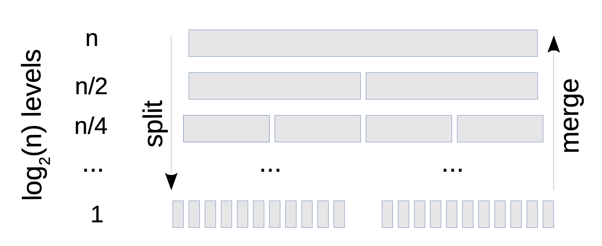

# 17. 정렬

정렬 알고리즘을 배워야 하는 이유
1. 대다수 응요 프로그램에서 잘 돌아가는 범용 알고리즘이 있지만, 기수정렬(radix sort)과 제한된 힙 정렬(bounded heap sort)는 알아둬야 한다.
2. 정렬 알고리즘의 하나인 병렬 정렬은 분할정복법, 선형 로그라는 증가 차수를 익힐 수 있게 해준다.
3. 면접 때문에... (진짜 책에 이렇게 써있네..ㅋ<sub>ㅋ</sub><sup>ㅋ</sup>)

## 17.1 삽입 정렬
### 정의
삽입 정렬(揷入整列, insertion sort)은 자료 배열의 모든 요소를 앞에서부터 차례대로 이미 정렬된 배열 부분과 비교하여, 자신의 위치를 찾아 삽입함으로써 정렬을 완성하는 알고리즘이다.
```java
public List<T> insertionSort(List<T> refList, Comparator<T> comparator) {
    List<T> list = refList.stream().collect(Collectors.toList());

    outer: for ( int i = 1; i < list.size(); i ++ ){
        T ref = list.get(i);
        int j = i;
    
        inner: for ( ; j > 0; j -- ) {
            T target = list.get(j - 1);
            if( comparator.compare(ref, target) >= 0) break inner;
            list.set(j, target);
        }
    
        list.set(j, ref);
    }

    return list;
}   
```
중첩된 반복문이 있다. 따라서 실행시간은 이차로 추측할 수 있다. 반복문을 보면 outer도 선형, inner도 선형이다.
총 1 ~ (n - 1)의 수열의 합이 되고, ((n * (n - 1)) / 2)가 되어 최대 차수는 n<sup>2</sup>가 된다.
기본적으로 이차지만, 아래와 같은 특징이 있다.

1. 요소가 이미 정렬되어 있거나 거의 정렬되어 있으면 삽입 정렬은 선형이다. 특히 각 요소가 있어야 하는 자리 기준 k 이하의 위치에
있다면 내부 반복문은 k 번 이하로 동작하게 되고 전체 실행 시간은 O(kn)이 된다.
2. 구현이 단순하므로 오버헤드가 작다. 즉, 실행 시간은 an<sup>2</sup>이지만 최대 차수의 계수인 a는 아마도 작을 것이다.

## 17.2 병합 정렬
하나의 리스트를 두 개의 균등한 크기로 분할하고 분할된 부분 리스트를 정렬한 다음, 두 개의 정렬된 부분 리스트를 합하여 전체가 정렬된 리스트가 되게 하는 방법이다
합병 정렬은 다음의 단계들로 이루어진다.
1. 분할(Divide): 입력 배열을 같은 크기의 2개의 부분 배열로 분할한다.
2. 정복(Conquer): 부분 배열을 정렬한다. 부분 배열의 크기가 충분히 작지 않으면 순환 호출 을 이용하여 다시 분할 정복 방법을 적용한다.
3. 결합(Combine): 정렬된 부분 배열들을 하나의 배열에 합병한다.


아래는 직접 구현한 병합 정렬이다. (정답이라고 확신하기 어렵지만...)
```java
 public List<T> mergeSort(List<T> refList,  Comparator<T> comparator){

    if( refList.size() < 2 ) return refList;
    else {
        List<T> left  = mergeSort(refList.subList(0, Math.floorDiv(refList.size(), 2)), comparator);
        List<T> right  = mergeSort(refList.subList(Math.floorDiv(refList.size(), 2), refList.size()), comparator);


        List<T> result = new ArrayList<>();
        merge(left, right, result, comparator);
        return result;
    }
}

private List<T> merge (List<T> left, List<T> right, List<T> result, Comparator<T> comparator) {
    if( left.isEmpty() && right.isEmpty() ) return result;
    if( left.isEmpty() ) {
        result.addAll(right);
        return result;
    }
    if( right.isEmpty() ) {
        result.addAll(left);
        return result;
    }


    List<T> leftCopy = left.stream().collect(Collectors.toList());
    List<T> rightCopy = right.stream().collect(Collectors.toList());
    T leftElement = leftCopy.get(0);
    T rightElement = rightCopy.get(0);
    int compare = comparator.compare(leftElement, rightElement);
    if( compare > 0 ) {
        result.add(rightElement);
        rightCopy.remove(rightElement);
    } else if ( compare < 0){
        result.add(leftElement);
        leftCopy.remove(leftElement);
    } else {
        result.add(rightElement);
        result.add(leftElement);
        leftCopy.remove(leftElement);
        rightCopy.remove(rightElement);
    }


    merge(leftCopy, rightCopy, result, comparator);
    return result;
}
```


1. 두 개의 새로운 배열을 반들고 반쪽씩 복사한다. : 각 요소를 한 번 복사한다. 선형이다. 
2. 두 개의 반쪽들을 정렬한다.
3. 반쪽들을 병합한다. : 각 요솔르 한 번 복사한다. 선형이다. 

두 번째는 간단하지 않다. 


1번을 거듭하면서 n개 에서 n/2 길이를 갖는 배열 2개, 여기에서 n/4 길이를 갖는 배열 4개. 이를 반복해서 n개의 리스트까지 계속한다. 
모든 수준에는 총 n개의 요소가 있다. 내려가면서 배열을 반드로 나누는데, 이떄 모든 수준에서 n에 비례하는 시간이 걸린다. 다시 병합할 때는 선형이다.

수준의 개수가 h라면 알고리즘의 전체 작업량은 O(nh)가 된다. 여기서 h가 얼마나 될까?
1. 1로 가기까지 n을 얼마나 반으러 나눠야하나?
2. 1네서 n으로 돌아가기 위해 2배를 몇 번이나 해야할까? ( 이 질문은 n은 2의 몇 제곱일까? 라는 질문과 같다. )

    
> 2<sup>h</sup> = n

로그를 씌우면 아래와 같다. 

>h = log<sub>2</sub>n

결과적으로 전체 시간은 O( n log<sub>2</sub> n)이 된다.  O( n log<sub>2</sub> n)는 요소들을 비교하는 작동하는 정렬 알고리즘의 이론적 하한선이라고 알려졌다.
즉, 비교 정렬 중에서는 n log<sub>2</sub> n보다 좋은 증가 차수가 없다는 뜻이다.

## 17.2.1 버블 정렬
가장 느린 정렬이다. O(n<sup>2</sup>)을 가진다.
```java
public List<T> bubbleSort(List<T> refList, Comparator<T> comparator) {
    List<T> copy = new ArrayList<>(refList);
    outer: for ( int i = 0; i < copy.size(); i ++) {
        inner: for (int j = 1; j< copy.size() - i; j ++) {
                if( comparator.compare(copy.get(j - 1), copy.get(j)) > 0) {
                    T element = copy.get(j - 1);
                    copy.set(j - 1, copy.get(j));
                    copy.set(j, element);
                }
        }
    }
    return copy;
}
```
순회하는 일차 두 개를 사용해서 이차가 된다. 


## 17.4 기수 정렬
기수 정렬은 비교하지 않는(non-comparison) 정렬 알고리즘으로 32bit 정수 또는 20 character 문자열 같이 제한된 경우에 동작한다. 

1. 첫 번째 글자를 기준으로 버킷에 나눈다. 
2. 다시 두 번째 글자를 기준으로 버킷을 나눈다. 
3. 다시 세 번째 글자를 기준으로 버킷을 나눈다.


각 패스에서 요소에 반복문을 실행하고 버킷에 추가한다. 요소를 버킷에 추가하는 연산이 상수 시간인 한 각 단계는 선형이다. 
w라는 패스의 수는 단어의 너비에 의존하지만, 단어의 개수인 n에는 의존하지 않는다. 따라서 증가 차수는 O (wn)으로 n에 선형이다.

## 17.5 힙 정렬
제한된 크기의 요소를 정렬하는 기수 정렬에 더해서 제한된 힙 정렬이라는 또하나의 특수 목적 정렬 알고리즘이 있다. 제한된 힙 정렬은 매우 큰 데이터셋에서
상위 10개 또는 상위 k개를 보고하는데 유용하다. 이때 k는 n(매우 큰 데이터 셋)보다 훨씬 작아야 한다. 실행 시간은 n log n에 비례하며, 단일 프로그램 메모리에
모두 적재할 수 없게 때문에 매우 느리다. 이 때는 외부 정렬<sup>[[1]](#extSort)</sup> 알고리즘을 사용해야한다.

힙 정렬을 이해하려면 먼저 이진 탐색 트리(BST)<sup>[[2]](#bst)</sup>와 유사한 힙(heap)을 이해해야 한다. 이 둘의 차이점은 아래와 같다. 

- BST에서 모든 노드인 x는 'BST 속성'을 갖는다. 즉, x의 왼쪽 트리는 x보다 작고 오른쪽 트리는 x보다 크다.
- 힙에서 모든 노드인 x은 '힙 속성을 갖는다.' x의 양츨 하위 트리의 노드는 모두 x보다 크다.
- 힙은 균형 BST와 같다. 요소를 추가하거나 제거하면 힙은 트리의 균형을 맞추는 작업을 추가로 한다. 

힙에 있는 가장 작은 요소는 항상 루트에 있고 상수 시간으로 찾을 수 있다. 추가하거나 제거하는 시간은 트리의 높이인 h에 비례한다. 
힙은 항상 균형 상태에 있기 때문에 h는 log n에 비례한다. 자바에서 PriorityQueue 클래스는 힙으로 구현되어 있으며, Queue 인터페이스에 정의된 offer, poll을 제공한다. 


------------------------------------------
<a name="extSort">[1]</a> : External sorting is a class of sorting algorithms that can handle massive amounts of data. External sorting is required when the data being sorted do not fit into the main memory of a computing device (usually RAM) and instead they must reside in the slower external memory, usually a disk drive. Thus, external sorting algorithms are external memory algorithms and thus applicable in the external memory model of computation.

External sorting algorithms generally fall into two types, distribution sorting, which resembles quicksort, and external merge sort, which resembles merge sort. External merge sort typically uses a hybrid sort-merge strategy. In the sorting phase, chunks of data small enough to fit in main memory are read, sorted, and written out to a temporary file. In the merge phase, the sorted subfiles are combined into a single larger file.

<a name="bst">[2]</a> : n computer science, a binary search tree (BST), also called an ordered or sorted binary tree, is a rooted binary tree data structure with the key of each internal node being greater than all the keys in the respective node's left subtree and less than the ones in its right subtree. The time complexity of operations on the binary search tree is linear with respect to the height of the tree.